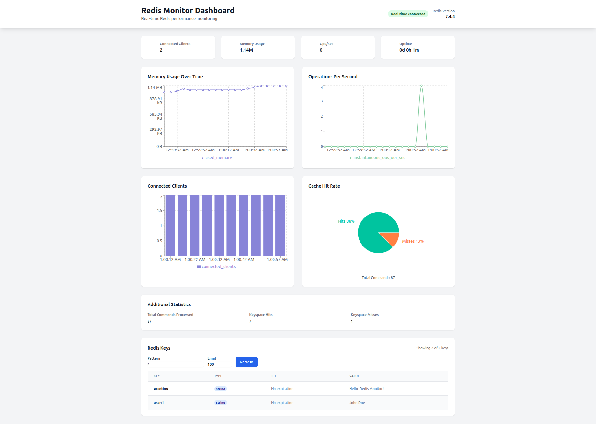

# Redis Monitor Dashboard


[](https://docs.docker.com/compose/)
[](https://nodejs.org/)
[](https://reactjs.org/)
[](https://redis.io/)
[](LICENSE)


A real-time Redis monitoring dashboard with interactive charts and metrics visualization. This project provides comprehensive insights into Redis server performance with a beautiful, responsive UI.

## Features

- **Real-time Monitoring**: Live Redis metrics with WebSocket updates
- **Interactive Charts**: Memory usage, operations per second, connected clients, and cache hit rate
- **Responsive Design**: Built with React and TailwindCSS
- **Docker Support**: Easy deployment with Docker Compose
- **Health Monitoring**: Connection status and uptime tracking


## Architecture

The application consists of three main components:

- **Frontend**: React 19 with TailwindCSS and Recharts for visualization
- **Backend**: Node.js with Express and WebSocket support
- **Database**: Redis server for monitoring

All components are containerized using Docker for easy deployment.

## Quick Start

### Prerequisites

- [Docker](https://www.docker.com/get-started) and [Docker Compose](https://docs.docker.com/compose/install/)
- [Node.js](https://nodejs.org/) 18+ (for local development)

### Running with Docker Compose

1. Clone the repository:
```bash
git clone https://github.com/yourusername/redis-monitor-dashboard.git
cd redis-monitor-dashboard
```

2. Start all services:
```bash
chmod +x start.sh
./start.sh

docker-compose up -d
```

3. Access the dashboard:
- Frontend: [http://localhost](http://localhost)
- Backend API: [http://localhost:3001](http://localhost:3001)
- Redis: localhost:6379

## Testing

### Testing the API

You can test the API endpoints directly using curl:

```bash
curl http://localhost:3001/api/health

curl http://localhost:3001/api/redis/metrics

curl http://localhost:3001/api/redis/info

curl http://localhost:3001/api/redis/keys
```

### Testing WebSocket Connection

You can test the WebSocket connection using [wscat](https://github.com/websockets/wscat):

```bash
npm install -g wscat

wscat -c ws://localhost/ws
```

Once connected, you should receive real-time metrics every 5 seconds.

## Local Development

### Backend Setup

```bash
cd backend
npm install
npm run dev
```

### Frontend Setup

```bash
cd frontend
npm install
npm start
```

## API Endpoints

| Endpoint | Method | Description |
|----------|--------|-------------|
| `/api/health` | GET | Health check |
| `/api/redis/info` | GET | Complete Redis information |
| `/api/redis/metrics` | GET | Formatted metrics for charts |
| `/api/redis/keys` | GET | Keys count |
| WebSocket `/ws` | - | Real-time metrics stream |

## Environment Variables

### Backend
- `REDIS_HOST` - Redis server hostname (default: redis)
- `REDIS_PORT` - Redis server port (default: 6379)
- `PORT` - Backend server port (default: 3001)

## Monitoring Metrics

The dashboard displays the following Redis metrics:

- **Connected Clients**: Number of active Redis connections
- **Memory Usage**: Current Redis memory consumption
- **Operations per Second**: Real-time operation rate
- **Cache Hit Rate**: Ratio of successful key lookups
- **Uptime**: Redis server uptime
- **Command Statistics**: Total commands processed

## Docker Services

| Service | Description |
|---------|-------------|
| **redis** | Redis 7 Alpine with persistence |
| **backend** | Node.js API server with health checks |
| **frontend** | React app served by Nginx |

## Development

### Project Structure

```
redis-monitor-dashboard/
├── docker-compose.yml    # Docker Compose configuration
├── README.md             # Project documentation
├── start.sh              # Startup script
├── assets/               # Project assets and images
├── backend/              # Node.js backend
│   ├── config/           # Configuration files
│   ├── controllers/      # API controllers
│   ├── services/         # Business logic
│   ├── src/              # Source code
│   ├── utils/            # Utility functions
│   └── websocket/        # WebSocket handlers
└── frontend/             # React frontend
    ├── public/           # Static files
    └── src/              # Source code
```

### Adding New Metrics

1. Update the `getMetrics()` function in `backend/services/metricsService.js`
2. Add new chart components in `frontend/src/App.js`
3. Update the real-time WebSocket handler in `backend/websocket/wsServer.js`

### Customizing Charts

The dashboard uses [Recharts](https://recharts.org/) library. Modify chart components in the frontend to add new visualizations.

## Troubleshooting

### Connection Issues
- Ensure Redis is running and accessible
- Check Docker network connectivity
- Verify environment variables

### WebSocket Errors
- Check backend logs for WebSocket server status
- Ensure port 3001 is accessible
- Verify proxy configuration in Nginx

To debug issues, check the logs:
```bash
docker-compose logs -f

docker-compose logs -f backend
docker-compose logs -f frontend
docker-compose logs -f redis
```

## Performance Testing

To simulate load on your Redis instance for testing:

```bash
docker exec -it redis-server redis-benchmark -n 100000 -c 50 -P 16 -q
```

Example test for specific operations:

```bash
docker exec -it redis-server redis-benchmark -t set -n 100000 -q

docker exec -it redis-server redis-benchmark -t get -n 100000 -q

docker exec -it redis-server redis-benchmark -t set,get,incr -n 50000 -q
```

For custom key size and value size testing:

```bash
# Test with larger values (1KB)
docker exec -it redis-server redis-benchmark -t set -n 10000 -d 1024 -q

# Test with many small operations
docker exec -it redis-server redis-benchmark -t ping -n 100000 -q
```

These benchmarks will help you observe how your Redis instance performs under various workloads and how the dashboard displays the metrics during high load scenarios.

## License

This project is licensed under the MIT License - see the [LICENSE](LICENSE) file for details.

